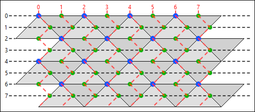

# Cultures 2 `*.dat` format

## Introduction

The following project is meant to be a tool for various mapping and modding
efforts regarding `*.dat` files in video games from [*Cultures*](https://de.wikipedia.org/wiki/Cultures_(Computerspielreihe))
series whichs engines are based on [*Cultures 2: The Gates of Asgard*](https://en.wikipedia.org/wiki/Cultures_2:_The_Gates_of_Asgard).
These are, including the aforementioned game, listed below.

 - [*Cultures 2: The Gates of Asgard*](https://en.wikipedia.org/wiki/Cultures_2:_The_Gates_of_Asgard)
 - [*Northland*](https://www.mobygames.com/game/8938/northland/)
 - [*8th Wonder of the World*](https://www.mobygames.com/game/8939/8th-wonder-of-the-world/)
 - [*Cultures: Die Saga*](https://www.mobygames.com/game/11159/cultures-die-saga/)


Using [`MapData`](./map_data.py) class defined in this project one can freely
read data from and write data to `*.dat` files. Exemplary usage is shown in
[`main.py`](./main.py) file. Do not confuse this file format with the one
present in *Cultures: Discovery of Vinland* and in the other older games
released as part of the *Cultures* series. This file format is completely
different from [`gouraud.dat`](https://github.com/Mikulus6/Cultures-map-editor/blob/main/documentation/formats/data.md)
files present there and is only relevant for `map.dat` files.  

## Documentation

### Map geometry

Terrain contained in `*.dat` files is composed of a two-dimensional triangular
grid. Triangles present on such a grid can be divided into two types:
triangles A (Δ) and triangles B (∇). These two types of triangles always
appear paired with each other. Ignoring distortion caused by elevation, the
composition of a pair of triangles is a parallelogram (Δ∇).

Vertices present in top left corners of parallelograms composed of paired A
triangle and B triangle are called *macro vertices*. In game, coordinates of
such vertices satisfy the following equation: `y mod 4 = 2·(x mod 2)`.

Additional vertices can be obtained by shifting any macro vertex. Vertices
obtained in this way always lie on the edge of a triangle A or triangle B. The
distance of the aforementioned shift is equal to half the length of the edge
along which the vertex is being shifted. These newly created vertices are
called *micro vertices*. In game, coordinates of such vertices are always a
pair of integers ranging from zero to one less than the appropriate map
dimension.

Macro vertices and micro vertices together make all the vertices on which
landscapes can be placed and between which creatures can move. When working
on problems related to these concepts it is useful to imagine only vertices
without underlying triangles. One can easily see that by rotating the image of
flat terrain by 45° the structure of vertices is geometrically equivalent to
the regular grid made out of squares. This explains intuitively why creatures
in the game can move in eight directions, which inherently is caused by
triangles not having all sides of the same length.

For cases without the constraint of predefined visual distance between
vertices one can notice that moving on triangular grid vertex by vertex is
topologically equivalent to moving on hexagonal grid tile by tile. This idea
in many cases simplifies required geometrical imagination.

It is important to note that vertical coordinate on this kind of grid does not
simply move in one direction as one might expect to happen by having intuition
from grids based on square repetition. Instead, vertical coordinate for all
triangles A, triangles B, macro vertices and micro vertices, moves in a zigzag
pattern.

All geometrical ideas described above are shown in the exemplary image below.



### File structure

The file format `*.dat` is composed of various parts called sections. Each
section starts with the text `hoix` and then is followed by a section name
with a length of four characters. It is important to note that all such texts
should be read in reverse. The reversed text of `hoix` is a shortened name for
*X Input-Output Handler*. Some section names remain ambiguous in the matter of
what their shortened reversed names stand for, but most of them are guessed
based on the content of the section and the overall context given by game
files. In this repository all such texts are reversed compared to how they
appear directly inside `*.dat` files, so that they are easier to read and
analyze.  

Following the section name, each section can be divided into a header and a
body. The header of the section contains, right after its name, four bytes
with a numerical value indicating the section type (which is always equal to
`1` with exceptions specified in [`parameters.py`](./sections/parameters.py)
file). The next four bytes specify the section length given as a number of
bytes of the section body. The following four bytes are empty. Four bytes
after that encode the section checksum which can be calculated given the
section body and using the algorithm present in [`checksum.py`](./sections/generic/checksum.py)
file. After that, again eight bytes are empty and they constitute the end of
the section header. Next, the body of a section is present, whose length was
given in the header.  

The exact binary interpretation of the section body is dependent on the
section name and type. Most of them however contain compressed two-dimensional
arrays which can be read using the run-length decryption algorithm present in
[`run_length.py`](./sections/generic/run_length.py) file. All other cases of
non-empty sections are handled using the [`SpecialSection`](./sections/special/special.py)
metaclass and are considered in [`MapData`](./map_data.py) methods. Some of
them represent one-dimensional arrays of strings - those are handled by the
[`TextSection`](./sections/special/texts.py) class.  

In short, each section present in `*.dat` file has the following structure:
```txt
char[4]  string_hoix;       // always "hoix"
char[4]  string_name;       // reversed section name
ubyte[4] section_type;      // one of values: 0, 1, 2, 4
ubyte[4] section_length;
ubyte[4] zeros_1;           // always zero
ubyte[4] checksum;          // can be calculated from body
ubyte[8] zeros_2;           // always zero
ubyte[section_length] body;
```

### Derivations

All sections can be divided into two types. These are primary sections and
secondary sections. Primary sections are those sections that are responsible
for data which is directly perceived on the map in the game and is also
intended to be directly editable by the map creator. One can think about
primary sections as phenomena whose qualities are significant for both the
player and such a map creator that does not have any need to manually read
game files. These sections are responsible for the placement of landscapes and
fish swarms as well as for terrain appearance.

Secondary sections, on the other hand, are those sections whose content can be
expressed as a function of a collection of primary sections and other game
files. In other words, given primary sections and game files, one can
determine what should be the exact correct content of any secondary section.
This means that from the technical point of view all secondary sections are an
investment of in-game physics computing time paid off by the increased memory
usage in `*.dat` files. These sections are responsible for hitboxes of
landscapes (calculated from the placement of landscapes), continent
numeration, and for many other things which are explained in detail later.

An algorithm used to obtain a certain secondary section given a set of other
sections is called a derivation. If the set of given sections to perform such
an algorithm can be reduced to any subset of all primary sections, such a
derivation is treated as completed. The file format `*.dat` is recognized as
solved if all primary sections have a known in-game meaning and all secondary
sections have a known completed derivation algorithm. Note that it is not
necessary to obtain the in-game meaning of a secondary section to solve the
`*.dat` file format if its derivation algorithm is known. That is because
derivation algorithms are surjective under the codomain of all valid states of
secondary sections.

There are some exceptions when a secondary section contains information that
cannot be derived from primary sections, yet it is not necessary to know its
meaning. Such a difference between an original secondary section and a derived
secondary section is called a corruption. From the purely rational standpoint
there is no mathematical difference between primary information and corrupted
information. However, there exists a simple empirical method to differentiate
between those two. Consider an original editor present in various games from
the Cultures series. Assume that for every simple action done in this editor
(such as for example placing a landscape on an empty vertex) there exists also
an inverse action (such as removing a landscape from the same vertex). It is
reasonable to assume that the algebraic composition of inverse actions should
result in the `*.dat` file content remaining the same. This is in fact not
always correct. The state of a secondary section is called corrupted when in
the original editor there exists an algebraic composition of a simple action
and its inverse action such that the state of the considered secondary section
does not remain the same afterward. Primary sections can be corrupted as well
in the same way, but it is not so significant when it is directly known what
in-game meaning primary sections have.

### Sections

| name   | type              | algorithms                                                    | comment                                                                                                                               |
|--------|-------------------|---------------------------------------------------------------|---------------------------------------------------------------------------------------------------------------------------------------|
| `logi` | ⬛&nbsp;empty     | -                                                             | empty                                                                                                                                 |
| `lgmm` | ⬛&nbsp;empty     | -                                                             | empty                                                                                                                                 |
| `lsiz` | 🗺️&nbsp;primary   | [`size.py`](./sections/special/size.py)                       | map size expressed as number of triangles in each dimension                                                                           |
| `lmhe` | 🗺️&nbsp;primary   | -                                                             | terrain elevation defined as an array with one byte per macro vertex                                                                  |
| `lmpa` | ⚙️&nbsp;secondary | [`logic_type.py`](./sections/arrays/logic_type.py)            | terrain triangles A patterns `LogicType` defined as an array with one byte per triangle                                               |
| `lmpb` | ⚙️&nbsp;secondary | [`logic_type.py`](./sections/arrays/logic_type.py)            | terrain triangles B patterns `LogicType` defined as an array with one byte per triangle                                               |
| `lmlt` | ⚙️&nbsp;secondary | [`logic_type.py`](./sections/arrays/logic_type.py)            | landscapes `LogicType` defined as an array with one byte per micro vertex                                                             |
| `lmlv` | 🗺️&nbsp;primary   | -                                                             | landscape valency (usually indicates durability, size or custom properties) defined as an array with one byte per micro vertex        |
| `lmlp` | 🗺️&nbsp;primary   | -                                                             | landscape player (used for indicating ownership and palette of stockade and gates) defined as an array with one byte per micro vertex |
| `lmco` | ⚙️&nbsp;secondary | [`continents.py`](./sections/arrays/continents.py)            | continents (numerical indicators of enclosed areas of land or water) defined as an array with one byte per micro vertex               |
| `lmtw` | ⚙️&nbsp;secondary | [`travel_way.py`](./sections/arrays/travel_way.py)            | availability of edges for movement defined as an array with one byte per micro vertex where six bits indicate six directions          |
| `lmms` | ⚙️&nbsp;secondary | [`moveable_size.py`](./sections/arrays/moveable_size.py)      | maximum allowed vehicle size with a limit of size `7` defined as an array with one byte per micro vertex                              |
| `lmpr` | ⚙️&nbsp;secondary | [`roughness.py`](./sections/arrays/roughness.py)              | roughness determining how much moving units are being slowed down defined as an array with one byte per micro vertex                  |
| `lmwb` | ⚙️&nbsp;secondary | [`block.py`](./sections/arrays/block.py)                      | binary indication of landscapes `LogicWalkBlockArea` defined as an array with one byte per micro vertex                               |
| `lmbb` | ⚙️&nbsp;secondary | [`block.py`](./sections/arrays/block.py)                      | binary indication of landscapes `LogicBuildBlockArea` defined as an array with one byte per micro vertex                              |
| `lmro` | ⚙️&nbsp;secondary | [`roads.py`](./sections/arrays/roads.py)                      | binary indication of presence of road overlay defined as an array with one byte per micro vertex                                      |
| `lmsb` | ⚙️&nbsp;secondary | [`block.py`](./sections/arrays/block.py)                      | binary indication of walk sector point presence defined as an array with one byte per micro vertex                                    |
| `lmao` | ⚙️&nbsp;secondary | [`attach.py`](./sections/arrays/attach.py)                    | vectorized landscapes `LogicAdditionalAttachPointArea` defined as an array with two bytes per micro vertex                            |
| `laco` | ⚙️&nbsp;secondary | [`continents.py`](./sections/arrays/continents.py)            | additional information for continents defined in the `lmco` section                                                                   |
| `lasw` | ⚙️&nbsp;secondary | [`walk_sectors.py`](./sections/special/walk_sectors.py)       | walk sectors data used by a pathfinding algorithm                                                                                     |
| `lafm` | 🗺️&nbsp;primary   | [`fishes.py`](./sections/special/fishes.py)                   | list of fish swarms                                                                                                                   |
| `lmhf` | ⚙️&nbsp;secondary | [`empty.py`](./sections/arrays/empty.py)                      | array of zeros with one byte per micro vertex (absent in older `*.dat` files)                                                         |
| `emmm` | ⬛&nbsp;empty     | -                                                             | empty                                                                                                                                 |
| `embr` | ⚙️&nbsp;secondary | [`brightness.py`](./sections/arrays/brightness.py)            | brightness of terrain vertices defined as an array with one byte per macro vertex                                                     |
| `emm1` | ⚙️&nbsp;secondary | [`infrastructure.py`](./sections/arrays/infrastructure.py)    | binary indication of visibility of road overlay defined as an array with one byte per macro vertex                                    |
| `emmi` | 🗺️&nbsp;primary   | -                                                             | type of road overlay on top of terrain patterns defined as an array with one byte per micro vertex                                    |
| `eapd` | 🗺️&nbsp;primary   | [`external_assets.py`](./sections/special/external_assets.py) | ordered list of pattern names stored as plain text                                                                                    |
| `empa` | 🗺️&nbsp;primary   | -                                                             | terrain patterns for triangles A defined as an array with two bytes per triangle                                                      |
| `empb` | 🗺️&nbsp;primary   | -                                                             | terrain patterns for triangles B defined as an array with two bytes per triangle                                                      |
| `eatd` | 🗺️&nbsp;primary   | [`external_assets.py`](./sections/special/external_assets.py) | ordered list of transition names stored as plain text                                                                                 |
| `emt1` | 🗺️&nbsp;primary   | [`transitions.py`](./sections/arrays/transitions.py)          | upper transitions for triangles A defined as an array with one byte per triangle                                                      |
| `emt2` | 🗺️&nbsp;primary   | [`transitions.py`](./sections/arrays/transitions.py)          | upper transitions for triangles B defined as an array with one byte per triangle                                                      |
| `emt3` | 🗺️&nbsp;primary   | [`transitions.py`](./sections/arrays/transitions.py)          | lower transitions for triangles A defined as an array with one byte per triangle                                                      |
| `emt4` | 🗺️&nbsp;primary   | [`transitions.py`](./sections/arrays/transitions.py)          | lower transitions for triangles B defined as an array with one byte per triangle                                                      |
| `eald` | 🗺️&nbsp;primary   | [`external_assets.py`](./sections/special/external_assets.py) | ordered list of landscape names stored as plain text                                                                                  |
| `emla` | 🗺️&nbsp;primary   | -                                                             | landscapes defined as an array with two bytes per micro vertex                                                                        |
| `emvc` | 🗺️&nbsp;primary   | -                                                             | colors of macro vertices (known as `vertexcolors`) defined as an array with one byte per macro vertex (absent in older `*.dat` files) |
| `xend` | ⬛&nbsp;empty     | -                                                             | empty                                                                                                                                 |
| `tend` | ⬛&nbsp;empty     | -                                                             | empty                                                                                                                                 |

## Credits

This project is a fan-made tool created by [CulturesNation](https://culturesnation.pl/)
community. It is not affiliated with the official legacy of *Cultures* series.
For official developers' website visit [Funatics](https://www.funatics.de/).

### Contributors

[Mikulus](https://github.com/Mikulus6): Managed project and wrote Python code.  
[Basssiiie](https://github.com/Basssiiie): Decompiled parts of game's engine via Ghidra.  
[Rumu](https://github.com/Rumu121/): Helped with empirical verifications in game.  
[Push42](https://github.com/push42): Helped with walk sectors data interpretation.
### Literature

[Watto](https://github.com/wattostudios): "[*Game Extractor*](https://www.watto.org/game_extractor.html)" (2004)  
[Bacter](mailto:the.bacter@gmail.com): "[*Unknown Encryption In Cultures Game*](https://web.archive.org/web/20210724220815/https://forum.xentax.com/viewtopic.php?t=3711)" (2010)  
[Red Blob Games](https://www.redblobgames.com/): "[*Hexagonal Grids*](https://www.redblobgames.com/grids/hexagons/)" (2013)  
[Siguza](https://github.com/Siguza): "[*Cultures 2 file formats*](https://web.archive.org/web/20210724220815/https://forum.xentax.com/viewtopic.php?t=10705)" (2013)  
[Nithanim](https://github.com/Nithanim): "[*Northland or 8th Wonder of the World map.dat file format*](https://gist.github.com/Nithanim/766c31475377b0bd594bab974a1de8d2)" (2019)  
[MartianBoy](https://github.com/martianboy): "[*cultures2-engine*](https://github.com/martianboy/cultures2-engine)" (2020)  
[Mikulus](https://github.com/Mikulus6): "[*Cultures map editor*](https://github.com/Mikulus6/Cultures-map-editor)" (2025)

### License

This program and its source code are distributed under [GNU General Public License 3.0](https://www.gnu.org/licenses/gpl-3.0.txt),
which can be found in the [`license.txt`](license.txt) file. *Cultures* itself
is the property of [Funatics Development](https://www.funatics.de/) with all
rights reserved as stated in the game readme, and is not covered by the
aforementioned license.