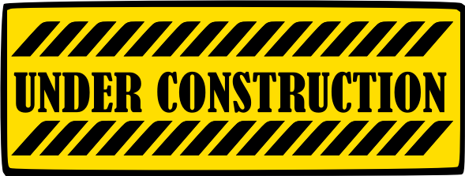

# Cultures2 Data Interpreter

## Introduction

The goal of this project is to write algorithms to freely read and modify
`*.dat` files in games from [*Cultures*](https://de.wikipedia.org/wiki/Cultures_(Computerspielreihe))
series whichs engine is based on [*Cultures 2: The Gates of Asgard*](https://en.wikipedia.org/wiki/Cultures_2:_The_Gates_of_Asgard).
Those are, excluding the mentioned game itself: [*Northland*](https://www.mobygames.com/game/8938/northland/),
[*8th Wonder of the World*](https://www.mobygames.com/game/8939/8th-wonder-of-the-world/) and
[*Cultures: Die Saga*](https://www.mobygames.com/game/11159/cultures-die-saga/).
The plan for this project is analogous to [Cultures Map Editor](https://github.com/Mikulus6/Cultures-map-editor).
For more information visit [CulturesNation](https://culturesnation.pl/).

### License

This program and its source code are distributed under [GNU General Public License 3.0](https://www.gnu.org/licenses/gpl-3.0.txt),
which can be found in the [`license.txt`](license.txt) file. *Cultures* itself
is the property of [Funatics Software](https://www.funatics.de/) with all
rights reserved as stated in the game manual, and is not covered by the
aforementioned license.